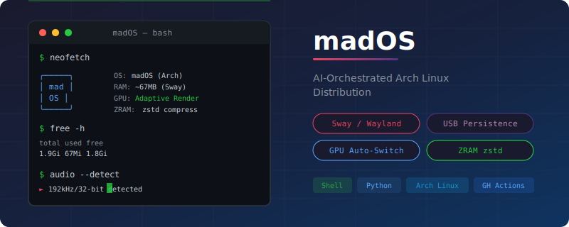
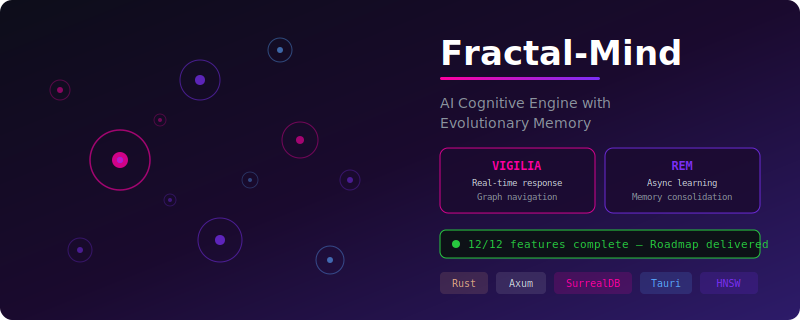
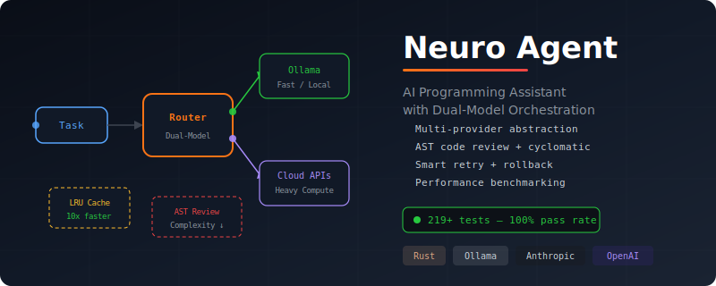
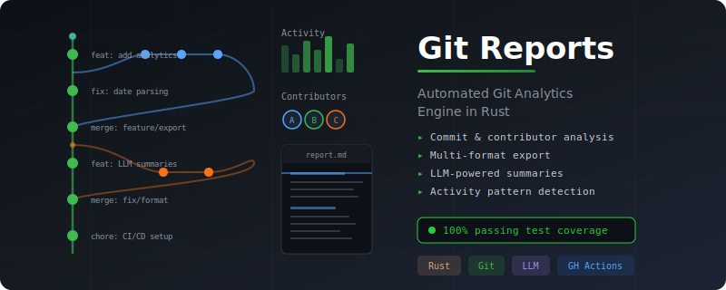
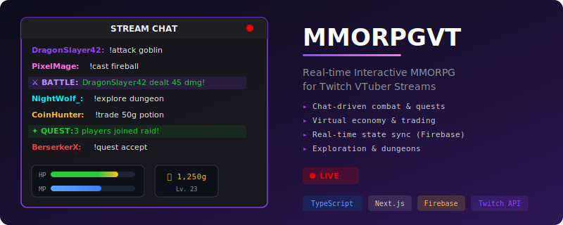
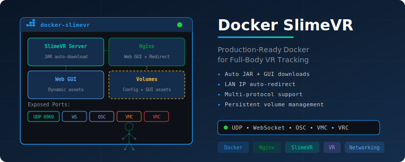

<h1 align="center">madKoding</h1>

  <strong>Software Engineer — AI Systems, Systems Programming & Full Stack</strong> 
  Chile

  

---

### About

Software engineer focused on **AI systems**, **systems-level programming in Rust**, and **full-stack development**. I design and build end-to-end solutions — from custom Linux distributions and embedded firmware to LLM orchestration engines and real-time web applications.

Currently building the **NEURO ecosystem**: an interconnected platform where [madOS](https://github.com/madkoding/mad-os) provides the AI-integrated OS layer, [Fractal-Mind](https://github.com/madkoding/fractalmind) serves as the cognitive memory engine, [Neuro Agent](https://github.com/madkoding/neuro-agent) orchestrates multi-model AI workflows, and [neuro-ollama](https://github.com/madkoding/neuro-ollama) manages GPU-accelerated local inference.

My work spans the full depth of the stack:

- **AI & Knowledge Systems** — RAG pipelines, LLM orchestration with multi-provider abstraction, vector embeddings, fractal graph-based memory architectures
- **Systems Programming** — Custom OS builds with adaptive hardware detection, kernel tuning, ZRAM compression, Wayland compositing
- **Full Stack** — React/Next.js frontends, Node.js/Express backends, REST APIs with JWT auth, real-time systems with WebSocket
- **Infrastructure & DevOps** — Docker multi-service architectures, GitHub Actions CI/CD, GPU-accelerated containerized inference
- **Embedded & IoT** — ESP32 firmware, VR tracking systems (SlimeVR), nRF52 BLE bootloaders, Android native (Kotlin)

---

### Featured Projects

<table>
<tr>
<td width="50%" valign="top">

#### [madOS](https://github.com/madkoding/mad-os)

AI-orchestrated Arch Linux distribution for resource-constrained systems (1.9GB+ RAM). Features adaptive GPU rendering (auto-switches between hardware acceleration and software fallback), ZRAM with zstd compression, audio quality auto-detection up to 192kHz/32-bit, USB persistence with dynamic space allocation, and Sway Wayland compositor at ~67MB RAM footprint. Automated ISO builds via GitHub Actions.

`Shell` `Python` `Arch Linux` `Wayland` `GitHub Actions`

</td>
<td width="50%" valign="top">

#### [Fractal-Mind](https://github.com/madkoding/fractalmind)

AI cognitive engine with evolutionary memory built on RAPTOR-based fractal graph structures and HNSW vector indexing over SurrealDB. Dual-phase architecture: **Vigilia** (wakefulness) for real-time response via graph navigation, **REM** (sleep) for asynchronous learning and memory consolidation. Multi-user namespace isolation, PDF/OCR ingestion, multi-embedding support (Nomic, BGE, CLIP). Full roadmap delivered — 12/12 features complete.

`Rust` `Axum` `SurrealDB` `Tauri` `Vector Embeddings`

</td>
</tr>
<tr>
<td width="50%" valign="top">

#### [Neuro Agent](https://github.com/madkoding/neuro-agent)

AI programming assistant in Rust with dual-model orchestration — routes tasks between fast local models (Ollama) and heavy compute providers (OpenAI, Anthropic, Groq) through a unified provider abstraction. Features AST-based code review with cyclomatic complexity detection, LRU context caching (10x response improvement), smart error recovery with retry/rollback, and a performance benchmarking framework with regression detection. 219+ tests, 100% pass rate.

`Rust` `Ollama` `Anthropic` `OpenAI` `ratatui`

</td>
<td width="50%" valign="top">

#### [Git Reports](https://github.com/madkoding/git-reports)

Automated Git analytics engine in Rust that generates work summaries from repository activity. Analyzes commits, contributors, and activity patterns across time periods with multi-format export. Integrates LLM-powered report generation for natural language summaries. CI/CD with GitHub Actions and 100% passing test coverage.

`Rust` `Git` `LLM` `GitHub Actions` `CI/CD`

</td>
</tr>
<tr>
<td width="50%" valign="top">

#### [MMORPGVT](https://github.com/madkoding/mmorpgvt)

Real-time interactive MMORPG engine for Twitch VTuber streams. Chat-driven mechanics: battles, exploration, virtual economy, and collaborative quests — all triggered from viewer commands. Built with Next.js and Firebase for real-time state sync. Full test suite with Jest, ESLint, Prettier, and automated formatting.

`TypeScript` `Next.js` `Firebase` `Jest` `Twitch API`

</td>
<td width="50%" valign="top">

#### [Docker SlimeVR](https://github.com/madkoding/docker-slimevr-web-server)

Production-ready Docker environment for SlimeVR full-body tracking server with dynamic Web GUI. Auto-downloads server JAR and GUI assets from GitHub releases, serves via Nginx with LAN IP auto-redirect. Exposes tracker (UDP 6969), WebSocket bridge, OSC router, VMC, and VRC ports. Persistent volume management for config and GUI assets.

`Docker` `Nginx` `SlimeVR` `VR` `Networking`

</td>
</tr>
</table>

> See all repositories at [github.com/madkoding?tab=repositories](https://github.com/madkoding?tab=repositories)

---

### Tech Stack

<table>
<tr>
<td valign="top" width="33%">

**Languages**
 

</td>
<td valign="top" width="33%">

**AI & Infrastructure**
 

</td>
<td valign="top" width="33%">

**Frameworks & Data**
 

</td>
</tr>
</table>

---

### Activity

  
  

  

  

---

  &nbsp;
  

<!-- AUTO-UPDATE-DATE -->
**Última actualización:** 2026-02-25 22:51:26 -03
