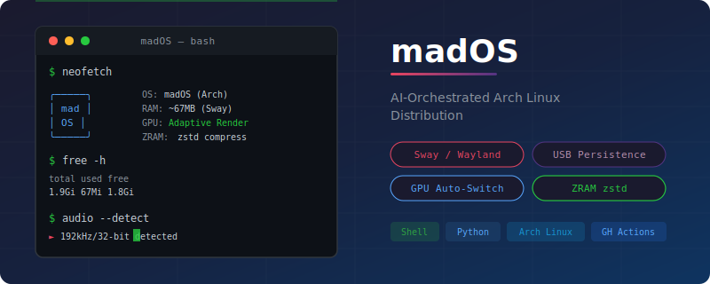
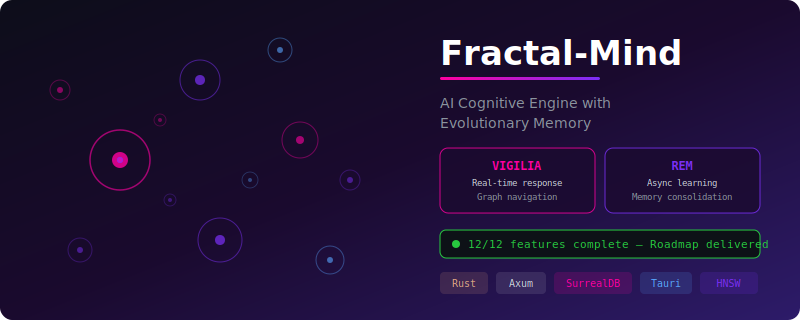
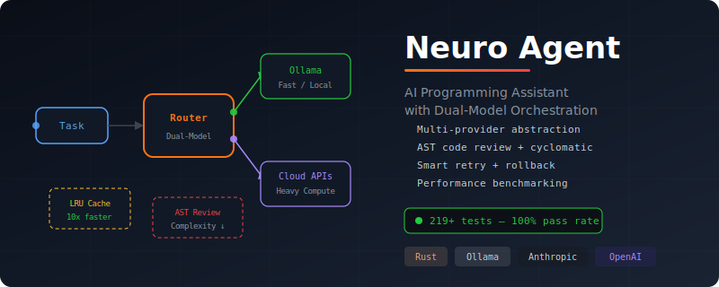
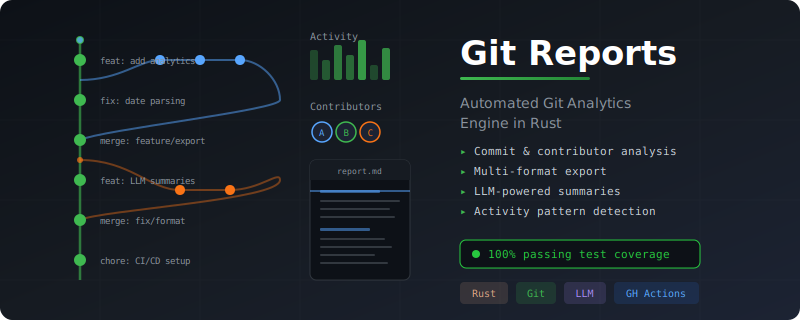

<h1 align="center">madKoding</h1>

  <strong>Senior Software Engineer — AI Systems & Infrastructure</strong> 
  Chile

  
  

---

### About

Senior software engineer specializing in **AI systems**, **systems programming**, and **distributed infrastructure**. I architect and deliver production-grade solutions spanning the entire stack — from kernel-level optimizations and embedded firmware to large language model orchestration engines and real-time web platforms.

Currently leading the **NEURO ecosystem**: a cohesive platform where [madOS](https://github.com/madkoding/mad-os) delivers AI-integrated OS infrastructure, [Fractal-Mind](https://github.com/madkoding/fractalmind) provides cognitive memory architectures, [Neuro Agent](https://github.com/madkoding/neuro-agent) orchestrates multi-model AI workflows, and [neuro-ollama](https://github.com/madkoding/neuro-ollama) enables GPU-accelerated local inference.

**Core Competencies:**

- **AI & Knowledge Engineering** — Multi-provider LLM orchestration, RAG pipelines, vector indexing (HNSW), fractal graph embeddings, cognitive memory systems
- **Systems Programming** — Custom Linux distributions, kernel tuning, hardware abstraction layers, Wayland compositing, memory optimization (ZRAM/zstd)
- **Backend & APIs** — High-performance Rust services (Axum), distributed architectures, REST/GraphQL APIs, real-time WebSocket systems
- **Infrastructure & DevOps** — Docker multi-service deployments, GitHub Actions CI/CD, GPU-accelerated containerization, automated ISO builds
- **Embedded & Firmware** — ESP32 IoT systems, VR/AR tracking (SlimeVR), nRF52 BLE bootloaders, Android native development

---

### Featured Projects

<table>
<tr>
<td width="50%" valign="top">

#### [madOS](https://github.com/madkoding/mad-os)

AI-orchestrated Arch Linux distribution optimized for resource-constrained environments (1.9GB+ RAM). Delivers adaptive GPU rendering with hardware acceleration fallback, ZRAM compression (zstd), high-fidelity audio support (192kHz/32-bit), and Sway Wayland compositor at ~67MB RAM. Fully automated ISO generation via GitHub Actions.

`Shell` `Python` `Arch Linux` `Wayland` `GitHub Actions`

</td>
<td width="50%" valign="top">

#### [Fractal-Mind](https://github.com/madkoding/fractalmind)

Production cognitive engine implementing RAPTOR-based fractal graphs with HNSW vector indexing over SurrealDB. Dual-phase architecture: **Vigilia** (real-time graph traversal) and **REM** (asynchronous consolidation). Features multi-user namespace isolation, multi-format ingestion (PDF/OCR), and multi-embedding support (Nomic, BGE, CLIP). Complete delivery — 12/12 roadmap features shipped.

`Rust` `Axum` `SurrealDB` `Tauri` `Vector Embeddings`

</td>
</tr>
<tr>
<td width="50%" valign="top">

#### [Neuro Agent](https://github.com/madkoding/neuro-agent)

Enterprise-grade AI programming assistant in Rust with intelligent multi-provider routing (Ollama, OpenAI, Anthropic, Groq). Implements AST-based code review with cyclomatic complexity analysis, LRU context caching (10× latency reduction), automatic error recovery with rollback, and comprehensive benchmarking suite with regression detection. 219+ tests, 100% pass rate.

`Rust` `Ollama` `Anthropic` `OpenAI` `ratatui`

</td>
<td width="50%" valign="top">

#### [Git Reports](https://github.com/madkoding/git-reports)

Automated Git intelligence engine in Rust that synthesizes work summaries from repository activity. Processes commits, contributor patterns, and temporal trends with configurable time windows and multi-format export. LLM-powered natural language generation for executive summaries. Full CI/CD pipeline with comprehensive test coverage.

`Rust` `Git` `LLM` `GitHub Actions` `CI/CD`

</td>
</tr>
<tr>
<td width="50%" valign="top">

#### [SopaipillaPHP](https://github.com/madkoding/sopaipillaphp)

Lightweight PHP 8+ micro-framework for JSON APIs with zero dependencies. Features attribute-based routing, typed DTOs with validation, multi-database ORM (PostgreSQL/MySQL/SQLite), and security-first design. Built for modern PHP development without framework bloat.

`PHP` `REST API` `ORM` `Type-Safe`

</td>
<td width="50%" valign="top">

#### [Venus Studios](https://github.com/madkoding/venusstudios)

Software development studio and digital design agency portfolio. Showcases projects, services, and technical capabilities across custom software, embedded systems, and AI solutions.

`Next.js` `TypeScript` `Web` `Agency`

</td>
</tr>
</table>

> See all repositories at [github.com/madkoding?tab=repositories](https://github.com/madkoding?tab=repositories)

---

### Tech Stack

<table>
<tr>
<td valign="top" width="33%">

**Languages**
 

</td>
<td valign="top" width="33%">

**AI & Infrastructure**
 

</td>
<td valign="top" width="33%">

**Frameworks & Data**
 

</td>
</tr>
</table>

---

### Activity

  

  
  

  
  

  

---

  &nbsp;
  &nbsp;
  

<!-- AUTO-UPDATE-DATE -->
**Última actualización:** 2026-03-08
