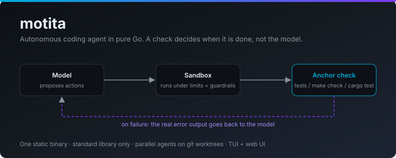
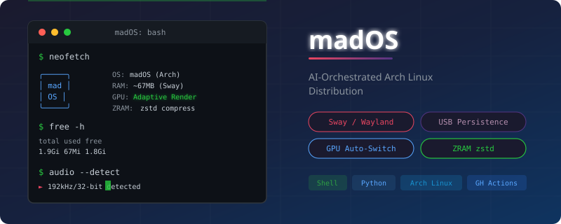
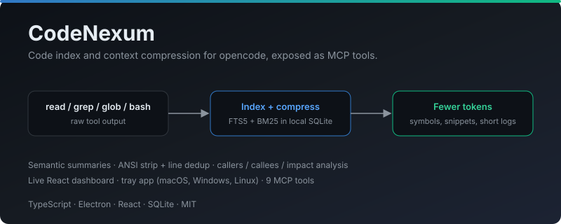
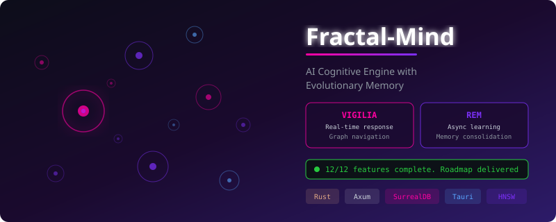
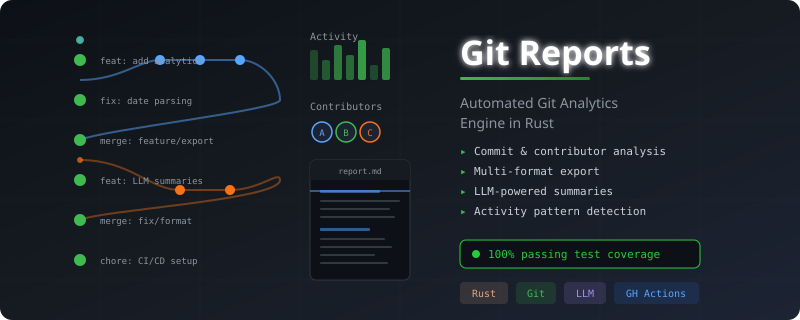
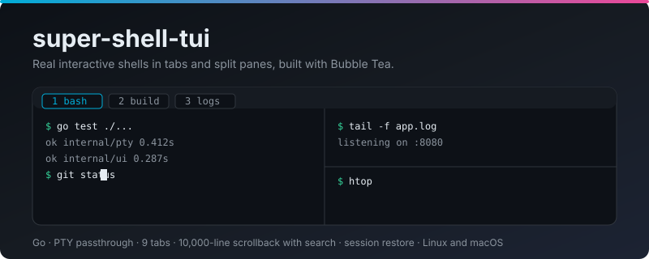

```aura width=860 height=220
<div style={{
  width: '100%', height: '100%', background: '#08080c',
  display: 'flex', alignItems: 'center', fontFamily: 'Inter',
  position: 'relative', overflow: 'hidden', borderRadius: 16,
  border: '1px solid rgba(110,80,220,0.18)'
}}>

  <style>{`
      @keyframes float-slow {
        0%, 100% { transform: translateX(0px); opacity: 0.8; }
        50% { transform: translateX(350px); opacity: 1.2; }
      }
      @keyframes float-medium {
        0%, 100% { transform: translateX(0px); opacity: 0.7; }
        50% { transform: translateX(-250px); opacity: 1.1; }
      }
      @keyframes float-fast {
        0%, 100% { transform: translateX(0px); opacity: 0.9; }
        50% { transform: translateX(200px); opacity: 0.6; }
      }
      @keyframes float-diagonal {
        0%, 100% { transform: translateX(0px); opacity: 0.75; }
        50% { transform: translateX(300px); opacity: 1.0; }
      }
      @keyframes float-wave {
        0%, 100% { transform: translateX(0px); opacity: 0.65; }
        33% { transform: translateX(-160px); opacity: 0.9; }
        66% { transform: translateX(80px); opacity: 1.0; }
      }
      @keyframes float-pulse {
        0%, 100% { transform: scale(1); opacity: 0.8; }
        50% { transform: scale(1.3); opacity: 0.4; }
      }
      #glow-1 { animation: float-slow 8s ease-in-out infinite; }
      #glow-2 { animation: float-medium 12s ease-in-out infinite; }
      #glow-3 { animation: float-fast 9s ease-in-out infinite; }
      #glow-4 { animation: float-slow 11s ease-in-out infinite reverse; }
      #glow-5 { animation: float-medium 14s ease-in-out infinite reverse; }
      #glow-6 { animation: float-diagonal 10s ease-in-out infinite; }
      #glow-7 { animation: float-wave 13s ease-in-out infinite; }
      #glow-8 { animation: float-pulse 7s ease-in-out infinite; }
    `}</style>

  <svg width="860" height="220" style={{ position: 'absolute', top: 0, left: 0 }}>
    <defs>
      <radialGradient id="g1" cx="50%" cy="50%" r="50%">
        <stop offset="0%" stopColor="rgba(110,20,210,0.72)" />
        <stop offset="40%" stopColor="rgba(90,15,180,0.35)" />
        <stop offset="70%" stopColor="rgba(90,15,180,0)" />
      </radialGradient>
      <radialGradient id="g2" cx="50%" cy="50%" r="50%">
        <stop offset="0%" stopColor="rgba(40,60,255,0.6)" />
        <stop offset="45%" stopColor="rgba(30,50,200,0.25)" />
        <stop offset="70%" stopColor="rgba(30,50,200,0)" />
      </radialGradient>
      <radialGradient id="g3" cx="50%" cy="50%" r="50%">
        <stop offset="0%" stopColor="rgba(0,130,255,0.45)" />
        <stop offset="50%" stopColor="rgba(0,100,220,0.18)" />
        <stop offset="70%" stopColor="rgba(0,100,220,0)" />
      </radialGradient>
      <radialGradient id="g4" cx="50%" cy="50%" r="50%">
        <stop offset="0%" stopColor="rgba(0,190,230,0.32)" />
        <stop offset="70%" stopColor="rgba(0,190,230,0)" />
      </radialGradient>
      <radialGradient id="g5" cx="50%" cy="50%" r="50%">
        <stop offset="0%" stopColor="rgba(90,30,200,0.38)" />
        <stop offset="70%" stopColor="rgba(90,30,200,0)" />
      </radialGradient>
      <radialGradient id="g6" cx="50%" cy="50%" r="50%">
        <stop offset="0%" stopColor="rgba(160,30,255,0.55)" />
        <stop offset="45%" stopColor="rgba(130,20,220,0.22)" />
        <stop offset="70%" stopColor="rgba(130,20,220,0)" />
      </radialGradient>
      <radialGradient id="g7" cx="50%" cy="50%" r="50%">
        <stop offset="0%" stopColor="rgba(20,60,255,0.42)" />
        <stop offset="50%" stopColor="rgba(10,40,200,0.16)" />
        <stop offset="70%" stopColor="rgba(10,40,200,0)" />
      </radialGradient>
      <radialGradient id="g8" cx="50%" cy="50%" r="50%">
        <stop offset="0%" stopColor="rgba(0,170,255,0.40)" />
        <stop offset="50%" stopColor="rgba(0,130,220,0.15)" />
        <stop offset="70%" stopColor="rgba(0,130,220,0)" />
      </radialGradient>
    </defs>

    <ellipse id="glow-1" cx="180" cy="230" rx="260" ry="190" fill="url(#g1)" />
    <ellipse id="glow-2" cx="300" cy="240" rx="220" ry="160" fill="url(#g2)" />
    <ellipse id="glow-3" cx="420" cy="240" rx="180" ry="140" fill="url(#g3)" />
    <ellipse id="glow-4" cx="550" cy="250" rx="150" ry="120" fill="url(#g4)" />
    <ellipse id="glow-5" cx="750" cy="250" rx="130" ry="110" fill="url(#g5)" />
    <ellipse id="glow-6" cx="300" cy="240" rx="180" ry="140" fill="url(#g6)" />
    <ellipse id="glow-7" cx="490" cy="230" rx="220" ry="170" fill="url(#g7)" />
    <ellipse id="glow-8" cx="590" cy="250" rx="150" ry="130" fill="url(#g8)" />
  </svg>

  <div style={{
    position: 'absolute', left: 40, top: 40, width: 120, height: 120,
    borderRadius: 60, background: 'linear-gradient(135deg, #6622ee, #0088ff)',
    display: 'flex', alignItems: 'center', justifyContent: 'center',
  }}>
    
  </div>

  <div style={{ display:'flex', flexDirection:'column', marginLeft:185, gap:10, zIndex: 10, paddingRight: 24 }}>
    <div style={{ display:'flex', fontSize:40, fontWeight:800, color:'#ffffff', letterSpacing:'-1px', lineHeight:1 }}>
      {github?.user?.name || github?.user?.login || 'madkoding'}
    </div>
    <div style={{ display:'flex', fontSize:15, color:'rgba(200,190,255,0.85)', fontWeight:400, letterSpacing:'0.2px' }}>
      Senior Software Engineer · AI Systems &amp; Infrastructure · VR/Maker Culture · Chile
    </div>
    <div style={{ display:'flex', gap:20, marginTop:4 }}>
      <div style={{ display:'flex', alignItems:'center', gap:5 }}>
        <div style={{ width:8, height:8, borderRadius:4, background:'#7c3aed' }} />
        <span style={{ fontSize:12, color:'rgba(180,165,255,0.75)', fontWeight:600 }}>
          {github?.user?.followers ?? '0'} followers
        </span>
      </div>
      <div style={{ display:'flex', alignItems:'center', gap:5 }}>
        <div style={{ width:8, height:8, borderRadius:4, background:'#0088ff' }} />
        <span style={{ fontSize:12, color:'rgba(180,165,255,0.75)', fontWeight:600 }}>
          {github?.user?.publicRepos ?? '0'} repositories
        </span>
      </div>
    </div>
    <div style={{ display:'flex', gap:8, marginTop:4, flexWrap: 'wrap' }}>
      {((github && github.languages && github.languages.length > 0)
        ? github.languages.slice(0, 5).map(function(l) { return l.name; })
        : ['Rust', 'TypeScript', 'Python', 'Swift', 'C']
      ).map(function(tag, i) {
        return (
          <div key={tag + '-' + i} style={{
            display:'flex', padding:'3px 11px', borderRadius:20,
            background:'rgba(80,40,220,0.18)', border:'1px solid rgba(100,70,240,0.32)',
            color:'rgba(205,195,255,0.85)', fontSize:11, fontWeight:600,
          }}>{tag}</div>
        );
      })}
    </div>
  </div>
</div>
```

<p align="center">
  <a href="https://user-badge.committers.top/chile/madkoding"></a>
  <a href="https://github.com/madkoding"></a>
  <a href="https://github.com/madkoding?tab=stars"></a>
  <a href="https://www.madtrackers.com"></a>
</p>

<p align="center">
  <a href="https://x.com/madkoding"></a>
  <a href="https://www.youtube.com/@madkoding"></a>
  <a href="https://twitch.tv/madkoding"></a>
  <a href="https://discord.gg/madkoding"></a>
</p>

---

### About

Full-stack software engineer based in Chile, building **autonomous AI agents**, **developer tooling** and **systems software** — from Go and Rust backends to React/TypeScript frontends, embedded firmware and a Linux distribution. I favor open-source, privacy-first software that runs on your own hardware: single static binaries, local models, no cloud lock-in.

Currently focused on [motita](https://github.com/madkoding/motita), an autonomous coding agent where a deterministic check — not the model — decides when the work is done. I also build production services (NestJS microservices, PostgreSQL, SSO integrations with Azure AD / SAML 2.0), and I work in Spanish and English. Beyond engineering, I am a **VTuber and content creator** focused on VR, full-body tracking and software development on Twitch and TikTok, and the creator of [madTrackers](https://www.madtrackers.com), a full-body VR tracking system (SlimeVR/VRChat).

**Core Competencies:**

- **AI Agents & Tooling** — Autonomous coding agents with verifiable outcomes, multi-provider LLM routing, MCP tools, context compression, RAG and cognitive memory (RAPTOR, HNSW)
- **Systems Programming** — Go and Rust single-binary software, terminal UIs, a custom Arch-based Linux distribution (archiso, Hyprland), kernel tuning
- **Backend & Integrations** — Rust (Axum), Go, NestJS microservices, PostgreSQL, REST and WebSocket APIs, SSO (Azure AD / SAML 2.0)
- **Frontend** — React, TypeScript, Preact, real-time web interfaces
- **Infrastructure & DevOps** — Docker, GitHub Actions CI/CD, automated ISO builds
- **Embedded & Hardware** — nRF52 / nRF54L firmware (Zephyr), ESP32 IoT, full-body VR tracking (madTrackers)

```aura width=860 height=110
<div style={{
  width: '100%', height: '100%', background: '#08080c',
  display: 'flex', alignItems: 'center', justifyContent: 'space-around',
  fontFamily: 'Inter', borderRadius: 16,
  border: '1px solid rgba(110,80,220,0.15)', padding: '0 40px', boxSizing: 'border-box',
}}>
  {[
    { color: '#7c3aed', label: 'Open Source', sub: 'Public projects under GPL, AGPL and MIT' },
    { color: '#0ea5e9', label: 'Resource Efficient', sub: 'Built for constrained hardware' },
    { color: '#10b981', label: 'Privacy-First', sub: 'Local models and single static binaries' },
    { color: '#f59e0b', label: 'VR & Maker Culture', sub: 'VTuber & content creator' },
  ].map(function(item) {
    return (
      <div key={item.label} style={{ display: 'flex', flexDirection: 'column', alignItems: 'center', gap: 6, maxWidth: 185 }}>
        <div style={{ width: 10, height: 10, borderRadius: 5, background: item.color }} />
        <span style={{ fontSize: 13, fontWeight: 700, color: '#e0d8ff', textAlign: 'center' }}>{item.label}</span>
        <span style={{ fontSize: 11, color: 'rgba(180,165,255,0.6)', textAlign: 'center', lineHeight: 1.4 }}>{item.sub}</span>
      </div>
    );
  })}
</div>
```

---

### Featured Projects

<table>
<tr>
<td width="50%" valign="top">

#### [motita](https://github.com/madkoding/motita)
[](https://github.com/madkoding/motita)
[](https://github.com/madkoding/motita/commits)



Autonomous AI coding agent in pure Go. The model only proposes actions; a project-defined check (`go test`, `make check`, `cargo test`, `pytest`…) decides when a task is done, feeds the real error output back on failure, and stops honestly instead of claiming success. Parallel agents on isolated git worktrees, terminal and web UI, sessions with checkpoints, and a sandbox with guardrails that cannot be disabled. One static binary, standard library only, no cgo. Works with OpenAI, Anthropic, Gemini, Ollama, Qwen and OpenAI-compatible hosts. 3,700+ tests.

`Go` `AI Agents` `Sandbox` `Git Worktrees` `TUI`

</td>
<td width="50%" valign="top">

#### [madOS](https://github.com/madoslinux/mad-os)
[](https://github.com/madoslinux/mad-os)
[](https://github.com/madoslinux/mad-os/commits)



Arch Linux distribution built with archiso for modern hardware with GPU acceleration: Hyprland (Vulkan/OpenGL), NVIDIA/AMD/Intel drivers, CUDA toolkit, the OpenCode AI assistant integrated out of the box, and a GTK graphical installer. Built as a family of components — linux-zen kernel with the BORE scheduler, an OTA updater with Btrfs snapshots, a launcher and media apps — under the [madoslinux](https://github.com/madoslinux) organization.

`Arch Linux` `Hyprland` `archiso` `GTK` `Btrfs`

</td>
</tr>
<tr>
<td width="50%" valign="top">

#### [CodeNexum](https://github.com/madkoding/codenexum)
[](https://github.com/madkoding/codenexum)
[](https://github.com/madkoding/codenexum/commits)



Code indexer and context compression engine for [opencode](https://opencode.ai). Replaces raw `read`, `grep`, `glob` and `bash` output with indexed chunks, semantic summaries and compressed logs (incremental FTS5 + BM25 over local SQLite), adds caller/callee impact analysis, and exposes 9 MCP tools. Includes a live dashboard and tray app. Reports 40–80% tool-output savings on mid-size projects.

`TypeScript` `Electron` `React` `SQLite` `MCP`

</td>
<td width="50%" valign="top">

#### [Fractal-Mind](https://github.com/madkoding/fractalmind)
[](https://github.com/madkoding/fractalmind/actions)



Production cognitive engine implementing RAPTOR-based fractal graphs with HNSW vector indexing over SurrealDB. Dual-phase architecture: **Vigilia** (real-time graph traversal) and **REM** (asynchronous consolidation). Features multi-user namespace isolation, multi-format ingestion (PDF/OCR), and multi-embedding support (Nomic, BGE, CLIP). Complete delivery — 12/12 roadmap features shipped.

`Rust` `Axum` `SurrealDB` `Tauri` `Vector Embeddings`

</td>
</tr>
<tr>
<td width="50%" valign="top">

#### [Git Reports](https://github.com/madkoding/git-reports)
[](https://github.com/madkoding/git-reports/actions)



Automated Git intelligence engine in Rust that synthesizes work summaries from repository activity. Processes commits, contributor patterns, and temporal trends with configurable time windows and multi-format export. LLM-powered natural language generation for executive summaries. Full CI/CD pipeline with comprehensive test coverage.

`Rust` `Git` `LLM` `GitHub Actions` `CI/CD`

</td>
<td width="50%" valign="top">

#### [super-shell-tui](https://github.com/madkoding/super-shell-tui)
[](https://github.com/madkoding/super-shell-tui/commits)



Terminal UI in Go (Bubble Tea) that embeds real interactive shells in tabs and split panes. Keys go straight to a PTY, so completion, history and reverse search behave like a normal terminal. Up to 9 tabs, zoom, 10,000-line scrollback with search, mouse support with OSC 52 copy, session restore, and a TOML config for keybindings and colors. Linux and macOS.

`Go` `Bubble Tea` `PTY` `TUI`

</td>
</tr>
</table>

### Also Building

- [**madTrackers**](https://www.madtrackers.com) — Full-body VR tracking: tracker and receiver firmware (nRF52 / nRF54L, Zephyr), server and storefront.
- [**Tachikoma**](https://github.com/madkoding/tachikoma) — Modular AI ecosystem with GraphRAG memory (SurrealDB), multi-model routing and built-in tools.
- [**KodingVibes**](https://github.com/kodingvibes) — Developer community platform: SSO, real-time chat with WebRTC voice rooms, and microfrontends.
- [**mmorpgvt**](https://github.com/madkoding/mmorpgvt) — Chat-driven MMORPG engine for VTuber Twitch streams.
- [**ESP32 Android Auto WiFi**](https://github.com/madkoding/esp32-android-auto-wifi) — ESP32 bridge that connects Android Auto over WiFi automatically.

> See all repositories at [github.com/madkoding?tab=repositories](https://github.com/madkoding?tab=repositories)

---

### Tech Stack

```aura width=860 height=360
<div style={{
  width: '100%', height: '100%', background: '#08080c',
  display: 'flex', flexDirection: 'column', fontFamily: 'Inter',
  padding: '28px 32px', borderRadius: 16, gap: 22,
  border: '1px solid rgba(110,80,220,0.15)', boxSizing: 'border-box',
}}>

  <style>{`
    @keyframes badge-in {
      from { opacity: 0; transform: translateY(6px); }
      to   { opacity: 1; transform: translateY(0); }
    }
    .badge { animation: badge-in 0.4s ease-out both; }
  `}</style>

  {[
    {
      label: 'Languages',
      color: '#7c3aed',
      items: ['Go', 'Rust', 'TypeScript', 'Python', 'C', 'C++', 'Kotlin', 'Swift'],
    },
    {
      label: 'AI & Infrastructure',
      color: '#0ea5e9',
      items: ['Ollama', 'Anthropic', 'OpenAI', 'Gemini', 'MCP', 'Docker', 'GitHub Actions', 'Linux', 'Arch Linux'],
    },
    {
      label: 'Frameworks & Data',
      color: '#10b981',
      items: ['Axum', 'NestJS', 'React', 'Preact', 'Next.js', 'Tauri', 'SurrealDB', 'PostgreSQL', 'MongoDB'],
    },
    {
      label: 'Embedded & Hardware',
      color: '#f59e0b',
      items: ['Zephyr', 'nRF52', 'nRF54L', 'ESP32', 'SlimeVR'],
    },
  ].map(function(group, gi) {
    return (
      <div key={group.label} style={{ display: 'flex', flexDirection: 'column', gap: 8 }}>
        <div style={{ display: 'flex', alignItems: 'center', gap: 8 }}>
          <div style={{ width: 10, height: 10, borderRadius: 5, background: group.color }} />
          <span style={{ fontSize: 11, fontWeight: 700, color: group.color, letterSpacing: '0.8px', textTransform: 'uppercase' }}>
            {group.label}
          </span>
        </div>
        <div style={{ display: 'flex', flexWrap: 'wrap', gap: 7 }}>
          {group.items.map(function(item, i) {
            return (
              <div key={item} className="badge" style={{
                animationDelay: (gi * 100 + i * 40) + 'ms',
                display: 'flex', padding: '4px 12px', borderRadius: 20,
                background: 'rgba(255,255,255,0.05)', border: '1px solid rgba(255,255,255,0.1)',
                color: 'rgba(220,215,255,0.82)', fontSize: 12, fontWeight: 600,
              }}>{item}</div>
            );
          })}
        </div>
      </div>
    );
  })}
</div>
```

---

### Activity

<p align="center">
  
</p>

<p align="center">
  
  
</p>

<p align="center">
  
  
</p>

<p align="center">
  
</p>

---

```aura width=860 height=60
<div style={{
  width: '100%', height: '100%',
  display: 'flex', alignItems: 'center', justifyContent: 'center',
  fontFamily: 'Inter', gap: 24,
  background: 'transparent',
}}>
  {[
    { label: 'X / Twitter', url: 'https://x.com/madkoding' },
    { label: 'YouTube', url: 'https://www.youtube.com/@madkoding' },
    { label: 'Twitch', url: 'https://twitch.tv/madkoding' },
    { label: 'Discord', url: 'https://discord.gg/madkoding' },
  ].map(function(link) {
    return (
      <span key={link.label} style={{
        fontSize: 13, fontWeight: 600,
        color: 'rgba(180,165,255,0.7)',
        letterSpacing: '0.3px',
      }}>{link.label}</span>
    );
  })}
</div>
```
